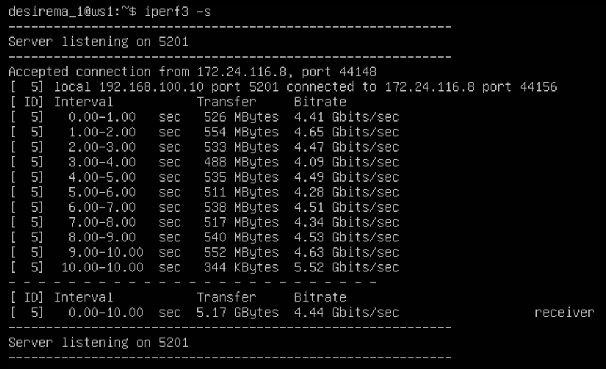
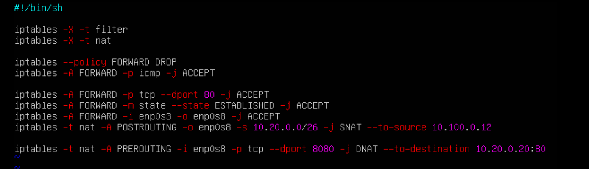

## Part 1. Инструмент **ipcalc**

 - 1.1. Сети и маски
 Определить и записать в отчёт:
 адрес сети *192.167.38.54/13*
 
 
 
 #### адрес сети: 192.168.0.0/13

*  перевод маски *255.255.255.0*:
	- префиксная запись - */24*
	- двоичная запись -  *11111111.11111111.11111111.00000000*

* перевод маски */15*:
	- обычная -*255.254.0.0*
	- двоичная -*11111111.11111111.11111110.00000000*

* перевод маски *11111111.11111111.11111111.11110000*:
	- обычная - 255.255.255.240
	- префиксная запись - /28

 
 * минимальный и максимальный хост в сети *12.167.38.4* при масках: 
 	- */8*
 	
 	- *11111111.11111111.00000000.00000000*
 	
 	- *255.255.254.0*
 	
 	- */4*
 	


 #### 1.2. localhost
 * Определить и записать в отчёт, можно ли обратиться к приложению, работающему на		localhost,со следующими IP: 
 	- *194.34.23.100* - нет.
 	- *127.0.0.2* - да.
 	- *127.1.0.1* - да.
 	- *128.0.0.1* - нет.

 #### 1.3. Диапазоны и сегменты сетей
 Определить и записать в отчёт:
 
* какие из перечисленных IP можно использовать в качестве публичного, а какие только в качестве частных: 
	- *10.0.0.45* - только частные сети.
	- *134.43.0.2* - публичный.
	- *192.168.4.2* - только частные сети. 
	- *172.20.250.4* - только частные сети.
	- *172.0.2.1*- публичный.
	- *192.172.0.1* - публичный.
	- *172.68.0.2*- публичный.
	- *172.16.255.255* - только частные сети. 
	- *10.10.10.10* - только частные сети.
	- *192.169.168.1*- публичный.
 

 * какие из перечисленных IP адресов шлюза возможны у сети *10.10.0.0/18*: 
 
 	- *10.0.0.1* - возможен.
 	- *10.10.0.2* - возможен.
 	- *10.10.10.10* - возможен.
 	- *10.10.100.1* - **не** возможен.
 	- *10.10.1.255* - возможен.

* Диапазон адресов, которые выделены под локальные сети:
 	- 10.0.0.0 — 10.255.255.255 с маской 255.0.0.0 (или кратко 10/8).
 	- 172.16.0.0 — 172.31.255.255 с маской 255.240.0.0 (или кратко 172.16/12).
 	- 192.168.0.0 — 192.168.255.255 (или кратко 192.168/16).
 	- 0.0.0.0/8 — диапазон адресов, используемый хостами для самоидентификации.
 	- 127.0.0.0/8 — loopback или localhost адреса. Это IP-адреса, используемые компьютером, чтобы обратиться к самому себе.
 	- 169.254.0.0/16 — link-local address или локальные адреса. Автоматически используются хостами при отсутствии DHCP-сервера или его недоступности.
 	- 224.0.0.0/4 — блок адресов, зарезервированный под многоадресную рассылку или multicast.

## Part 2. Статическая маршрутизация между двумя машинами

 * С помощью команды `ip a` посмотреть существующие сетевые интерфейсы
 	- ws1:
 
 	- ws2:
 


* ws1 - *192.168.100.10/16*
содержание изменённого файла *etc/netplan/00-installer-config.yaml*.

* ws2 - *172.24.116.8/12*
содержание изменённого файла *etc/netplan/00-installer-config.yaml*.


 * Выполняем команду `netplan apply` для перезапуска сервиса сети для обеих машин:
 	- ws1:
 	
 	- ws2:
 	


#### 2.1. Добавление статического маршрута вручную
* Добавляем статический маршрут от одной машины до другой и обратно при помощи команды вида `ip route add`
и пингуем соединение между машинами.
	- ws1:
	
	sudo sysctl net.ipv4.ip_forward=1
	- ws2:
	

#### 2.2. Добавление статического маршрута с сохранением

* Перезапускаем машины для сброса установленных маршрутов.
Добавляем статический маршрут от одной машины до другой с помощью файла *etc/netplan/00-installer-config.yaml*

	- файл настроек ws1:
	
	- файл настроек ws2:
	

* применяем настройки сети командой: `sudo netplan apply`

* Пингуем обе машины
	- от ws1 к ws2:
	
	- от ws2 к ws1:
	

## Part 3. Утилита **iperf3**


#### 3.1. Скорость соединения

для перевода используют следующие коэффиценты:
* 1 Mbps (мегабит в секунду) = 1000 Kbps (килобит в секунду)
* 1 Gbps (гигабит в секунду) = 1000 Mbps (мегабит в секунду)
* 1 MB/s (мегабайт в секунду) = 8 Mbps (мегабит в секунду)


* `8 Mbps = 8 / 8 = 1 MB/s`
* `100 MB/s = 100 * 8 * 1000 Kbps = 800000 Kbps`
* `1 Gbps = 1000 Mbps`


#### 3.2. Утилита **iperf3**
* запускаем **iperf3** в режиме сервера на ws1 командой: `iperf3 -s`


* запускаем **iperf3** в режиме клиента на ws2 командой: `iperf3 -с 192.168.100.10/16`


## Part 4. Сетевой экран

#### 4.1. Утилита **iptables**

* Создаем файл */etc/firewall.sh*, имитирующий фаерволл, на ws1 и ws2:
```shell
#!/bin/sh

# Удаление всех правил в таблице "filter" (по-умолчанию).
iptables –F
iptables -X
```
* создаем файлы firewall.sh для обеих машин:
	- ws1:
	
	- ws2:
	


* Запустим файлы на обеих машинах командами

> ` sudo chmod +x /etc/firewall.sh `

> ` sudo bash /etc/firewall.sh `

* и проверяем преминенные настройки iptables. 
	- ws1:
	
	- ws2:
	


* Если правило не соответствует пакету, пакет передается следующему правилу. Если правило соответствует пакету, оно выполняет действие, указанное целью/вердиктом, что может
привести к тому, что пакету будет разрешено продолжить движение по цепочке, а может и нет. Первое правило ws1 DROP разрывает цепочку, а первое правило ws2 ACCEPT разрывает цепочку, но пакеты ping передаются на ws2.
Соответсвенно одна машина, т.к. сначала идёт запрещающее правило. вторая машина будет, т.к. сначала идёт разрешающее правило.

	- ws1:
	
	- ws2:
	

#### 4.2. Утилита **nmap**

* проверяем машину которая не пингуется командой nmap:


## Part 5. Статическая маршрутизация сети

* Прежде чем понднять машины r1 и r2 добавляем каждой по одному четевому адаптеру:
	- r1:
	
	- r2:
	


#### 5.1. Настройка адресов машин
* Настраиваем конфигурации машин в *etc/netplan/00-installer-config.yaml* согласно сети на рисунке.
	- ws11:
	- ws21:
	- ws22:
	- r1:
	- r2:

* Применяем настройки сети. 

* командой `ip -4 a` проверить, что адрес машины задан верно скрины по этой команде в пункте 5.3

* пингуем ws22 c ws 21:


* пингуем r1 c ws 11:


#### 5.2. Включение переадресации IP-адресов.
* Выполняем команду `sysctl -w net.ipv4.ip_forward=1` для включения переадресации IP.
	- r1:
	- r2:

* Добавляем `net.ipv4.ip_forward = 1` в файл */etc/sysctl.conf*
	- r1:
	
	- r2:
	


* Для применения настроек из файла `/etc/sysctl.conf`, выполните следующую команду:

> `sudo sysctl -p`

- r1:

- r2:


##### 5.3. Установка маршрута по-умолчанию

* Настраиваем маршрут по-умолчанию (шлюз) для рабочих станций. Для этого добавить `default` перед IP роутера в файле конфигураций
содержание файла *etc/netplan/00-installer-config.yaml*
	- ws11:
	- ws21:
	- ws22:

* В отчёт поместить скрин с содержание файла *etc/netplan/00-installer-config.yaml*.
 Вызвать `ip r` и показать, что добавился маршрут в таблицу маршрутизации
	- ws11:
	
	- ws21:
	
	- ws22:
	
 

* Пингуем с ws11 роутер r2:
	- r2 не пингуется т.к. роутер не знает куда возвращать ответ.
	
	- Но с помощью команды `tcpdump -tn -i eth1` запущенной на r2 видим что пакеты с ws11 приходят на r2.
	

#### 5.4. Добавление статических маршрутов
* Добавляем в роутеры r1 и r2 статические маршруты в файле конфигураций etc/netplan/00-installer-config.yaml*.

	- r1:
	- r2:

* Вызваем `ip r` что бы посмотреть таблицы с маршрутами на обоих роутерах. 

	- r1:
	
	- r2:
	

* Запускаем команды на ` ws11 `

> ` ip r list 10.10.0.0/18 `

> ` ip r list 0.0.0.0/0 `


*Для адреса 10.10.0.0/18 был выбран маршрут, отличный от 0.0.0.0/0 (он попадает под маршрут по-умолч	анию), т.к. машина ws11 соединена с сетью 10.10.0.0/18 по своему IP-адресу 10.10.0.2, для других адресов используется маршрут по умолчанию, который указан в файле 10.10.0.1.

#### 5.5. Построение списка маршрутизаторов

* Запускаем команду на ` r1 ` команду:

> ` sudo tcpdump -tnv -i enp0s8 `

	- -n - не конвертировать адреса в имена;
	- -t - не выводить время при выводе каждой строкчи дампа;
	- -v - при синтаксическом анализе и выводить более подробную информацию. Например, печатаются время создания, общая длина и параметры IP-пакета. Также включает дополнительные проверки целостности пакетов, такие как проверка контрольной суммы заголовка IP и ICMP.


* При помощи утилиты ` traceroute ` построим список маршрутизаторов на пути от ` ws11 ` до ` ws21 `. 


* Для определения промежуточных маршрутизаторов traceroute отправляет целевому узлу серию ICMP-пакетов (по умолчанию 3 пакета), с каждым шагом увеличивая значение поля TTL («время
жизни») на 1. Это поле обычно указывает максимальное количество маршрутизаторов, которое может быть пройдено пакетом. Первая серия пакетов отправляется с TTL, равным 1, и поэтому 
первый же маршрутизатор возвращает обратно ICMP-сообщение «time exceeded in transit», указывающее на невозможность доставки данных. Traceroute фиксирует адрес маршрутизатора, а 
также время между отправкой пакета и получением ответа (эти сведения выводятся на монитор компьютера). Затем traceroute повторяет отправку серии пакетов, но уже с TTL, равным 2, 
что заставляет первый маршрутизатор уменьшить TTL пакетов на единицу и направить их ко второму маршрутизатору. Второй маршрутизатор, получив пакеты с TTL=1, так же возвращает «time 
exceeded in transit».

Процесс повторяется до тех пор, пока пакет не достигнет целевого узла. При получении ответа от этого узла процесс трассировки считается завершённым.

На оконечном хосте IP-датаграмма с TTL = 1 не отбрасывается и не вызывает ICMP-сообщения типа срок истёк, а должна быть отдана приложению. Достижение пункта назначения определяется следующим образом: отсылаемые traceroute датаграммы содержат UDP-пакет с заведомо неиспользуемым номером порта на адресуемом хосте. Номер порта будет равен 33434 + (максимальное количество транзитных участков до узла) — 1. В пункте назначения UDP-модуль, получая подобные датаграммы, возвращает ICMP-сообщения об ошибке «порт недоступен». Таким образом, чтобы узнать о завершении работы, программе traceroute достаточно обнаружить, что поступило ICMP-сообщение об ошибке этого типа.


#### 5.6. Использование протокола **ICMP** при маршрутизации


- Запускаем на ` r1 `  tcpdump на интерфейсе ` enp0s3 ` с помощью команды

> ` sudo tcpdump -n -i enp0s8 icmp `


- пингуем с ` ws11 ` несуществующий IP (например, 10.30.0.111) с помощью команды 

> ` ping -c 3 10.30.0.111 `


- Сохраняем дампы образов виртуальных машин.


## Part 6. Динамическая настройка IP с помощью **DHCP**


* Для r2 настраиваем в файле */etc/dhcp/dhcpd.conf* конфигурацию службы **DHCP**:


* в файле */etc/resolv.conf* на r2 прописываем `nameserver 8.8.8.8.`:


* Перезагружаем службу **DHCP** командой `systemctl restart isc-dhcp-server`:


* Перезагружаем ws21 перезагрузить при помощи `reboot` и через `ip a` видим, что она получила адрес:


	- во второй строчке видим адрес 10.20.0.2 - это адрес назначенный dhcp.

* пингуем ws22 с ws21 по новому адресу:


* указываем  MAC адрес у ws11 в *etc/netplan/00-installer-config.yaml* надо добавить строки:


* устанавливаем новый мак-адрес: для этого нужно не только применить настройки netplan но и перезапустить интерфейс.


* выключчаем ws командой: `poweroff` и устанавливаем нужный мак-адресс в virtualbox.


* Для r1 настраиваем в файле */etc/dhcp/dhcpd.conf* конфигурацию службы **DHCP**:


* в файле */etc/resolv.conf* на r2 прописываем `nameserver 8.8.8.8.`:


* Перезагружаем службу **DHCP** на r1.

> ` systemctl restart isc-dhcp-server `


* запрашиваем с ws21 обновление ip адреса:

	- адрес ws21 до:
	
	- получаем новый ip:
	

* сбрасываем старый: `dhclient -v -r`
* получаем новый: `dhclient -v`


* в части 6 были использованы следующие опции DHCP протокола:
	- option routers ip-address [, ip-address…]; - адреса шлюзов для клиентской сети. Маршрутизаторы должны быть перечислены в порядке предпочтительности.
	- option domain-name-servers ip-address [, ip-address…]; - Список DNS серверов доступных клиенту. Сервера должны быть перечислены в порядке предпочтительности.


* сохраняем дампы виртуальных машин.

## Part 7. **NAT**
* подключаем сетевой адаптер nat к ws22 и к r1 в virtualbox что бы установить apache2.
устанавливаем apache2 командой: `sudo apt install apache2`


* в файле */etc/apache2/ports.conf* на ws22 и r1 изменияем строку `Listen 80` на `Listen 0.0.0.0:80`
	- r1:
	
	- ws22:
	


* запускаем веб-сервер Apache командой `service apache2 start` на ws22 и r1
и проверяем его статус командой: `sudo systemctl status apache2.service`

	- r1:
	- ws22:

*  Добавляем в фаервол,на r2 следующие правила:
 	1) удаление правил в таблице filter - `iptables -F`
 	2) удаление правил в таблице "NAT" - `iptables -F -t nat`
 	3) отбрасывать все маршрутизируемые пакеты - `iptables --policy FORWARD DROP`
 

 
 * Запускаем файл:

> ` sudo chmod +x /etc/firewall.sh `

> ` sudo bash /etc/firewall.sh `

 * Проверяем соединение между ws22 и r1 командой `ping`:
 до применения firewall.sh:
 
 
 
 * после:
 
 
 

 * Добавляем в файл ещё одно правило:
 	- разрешить маршрутизацию всех пакетов протокола **ICMP**:
 


 * Проверяем соединение между ws22 и r1 командой `ping`:
 
 
 
	- включаем **SNAT**, а именно маскирование всех локальных ip из локальной сети, находящейся за ` r2 ` (по обозначениям из Части 5 - сеть 10.20.0.0)

	- включаем **DNAT** на 8080 порт машины ` r2 ` и добавим к веб-серверу Apache, запущенному на ` ws22 `, доступ извне сети

	> ` sudo vim /etc/apache2/ports.conf `


 

> Значения опций:
> - ` t ` - указывает на используемую таблицу;
> - ` p ` - указывает протокол, такие как tcp, udp, udplite и другие, поддерживаемые системой, ознакомиться со списком можно в файле ` /etc/protocols `;
> - ` m ` - подключает указанный модуль;
> - ` s ` - указывает адрес источника пакета, в качестве значения можно указать как один IP-адрес, так и диапазон;
> - ` i ` - задает входящий сетевой интерфейс;
> - ` o ` - указывает исходящий сетевой интерфейс;
> - ` --dport ` - порт получателя пакета;
> - ` DNAT ` — подменяет адрес получателя в заголовке IP-пакета, основное применение — предоставление доступа к сервисам снаружи, находящимся внутри сети;
> - ` SNAT ` — служит для преобразования сетевых адресов, применимо, когда за сервером находятся машины, которым необходимо предоставить доступ в Интернет, при этом от провайдера имеется статический IP-адрес.
> - `--to-source` используется для указания адреса, присваиваемому пакету, теперь именно этот адрес будет указываться в качестве исходящего.
> - `--to-destination` указывает, какой IP адрес должен быть подставлен в качестве адреса места назначения.

 Запускаем файл:

> ` sudo chmod +x /etc/firewall.sh `

> ` sudo bash /etc/firewall.sh `


Проверяем соединение по TCP для SNAT, для этого с ` ws22 ` подключаемся к серверу Apache на ` r1 ` командой ` telnet [адрес] [порт] `

 ` telnet 10.100.0.11 80 `


* проверяем подмену IP-адреса с tcpdump - пингуем с машины ws22 роутер r1, в выводе tcpdump будет отображаться с какого адреса идет запрос - IP-адрес r2:
	- r1:
	
	- ws22:
	
	

* проверяем соединение по TCP для **DNAT**, для этого с r1 подключаемся к серверу Apache на ws22 командой `telnet` (обращаться по адресу r2 и порту 8080)


* проверяем подмену IP-адреса с tcpdump - пингуем ws22 с  r1, в выводе tcpdump будет отображаться с какого адреса идет запроc:
	- r1:
		
	- ws22:
	


Сохраняем дампы образов виртуальных машин


## Part 8. Дополнительно. Знакомство с **SSH Tunnels**


* возвращаем машины к состоянию 5й части:


* запускаем на r2 фаервол с правилами из Части 7


* запускаем веб-сервер **Apache** на ws22 только на localhost (то есть в файле */etc/apache2/ports.conf* изменить строку `Listen 80` на `Listen localhost:80`):


* используем *Local TCP forwarding* с ws21 до ws22, чтобы получить доступ к веб-серверу на ws22 с ws21

* Перезапускаем Apache командой:
> `sudo systemctl restart apache2`

#### используем *Local TCP forwarding* с ws21 до ws22, чтобы получить доступ к веб-серверу на ws22 с ws21

Переадресация локального порта позволяет перенаправить порт на локальном компьютере (клиент ssh) на порт на удаленном компьютере (сервер ssh), который затем перенаправляется на порт на компьютере назначения.
В этом типе переадресации клиент SSH прослушивает заданный порт и туннелирует любое подключение к этому порту к указанному порту на удаленном сервере SSH, который затем подключается к порту на целевом компьютере. Конечным компьютером может быть удаленный SSH-сервер или любой другой компьютер.


- На машине ` ws22 `: создадим соединение с машины ` ws22 `, на которой установлен сервер ` ssh `, с машиной ` ws 21 `.
- Создаём соединение. Запускаем на машине ` ws22 `

> ` ssh 10.20.0.20 `


* На машине ` ws21 `: с помощью команды ` ssh -L ` прокинем "прямое" соединение с машины ` ws21 ` на машину ` ws22 `.


> ` ssh -L 8080:127.0.0.1:80 10.20.0.20 `

 	

* На машине ` ws21 ` запускаем утилиту ` telnet `

> ` telnet 127.0.0.1 8080 `


#### используем ` Remote TCP forwarding ` c ` ws11 ` до ` ws22 `, чтобы получить доступ к веб-серверу на ` ws22 ` с ` ws11 `.

* Переадресация удаленного порта противоположна переадресации локального порта. Это позволяет перенаправить порт на удалённом компьютере (сервер ssh) на порт на локальном 
компьютере (клиент ssh), который затем перенаправляется на порт на компьютере назначения.
В этом типе переадресации сервер SSH прослушивает заданный порт и туннелирует любое соединение с этим портом на указанный порт локального клиента SSH, который затем подключается к 
порту на целевом компьютере. Машина назначения может быть локальной или любой другой машиной. Удаленное перенаправление портов в основном используется для предоставления доступа к 
внутренней службе кому-то извне.

* Из-за того что на роутере ` r2 ` настроен firewall, подключиться к серверу Apache на машине ` ws22 ` с помощью команды ` ssh -L `, с машины ` ws11 `, не получится (роутер ` r2 ` не пропустит команду). В этом случае необходимо воспользоваться командой ` ssh -R `. Выполнить её необходимо на машине ` ws22 `. 


1) На машине ` ws11 `: На машине ` ws11 `: переход с машины ` ws11 ` на роутер ` r2 ` с помощью ` ssh ` (роутер не позволит сразу перейти на машину ` ws22 `);

- Пробрасываем маршрут. Запускаем с машины ` ws11 ` команду.

> ` ssh 10.100.0.12 `

- Благодаря этой команде находясь на машине ` ws11 ` можно увидить следующую картину, в которой изменится хост текущей машины на ` r2 `


2) На машине ` ws11 `: переход с роутера ` r2 ` на машину ` ws22 ` с помощью ` ssh `;

- Далее находясь физически на той же машине ` ws11 ` с именем хоста ` r2 `, вводим следующую команду

> ` ssh 10.20.0.20 `

- Находясь на машине ` ws11 `, получим следующий результат ` r2 ` -> ` ws22 `


3) На машине ` ws11 `: проброс туннеля с машины ` ws22 ` на машину ` ws11 ` с помощью ` ssh -R `;


* В предыдущей части на роутере ` r2 ` был настроен на ` fireWall `, который не пропускает проходящие пакеты из другой сети. Поэтому сначала необходимо пробросить тунель от ` ws22 ` к ` ws11 `. Для этого запускаем на машине ` ws11 ` команду

> ` ssh -R 10.10.0.2:8080:127.0.0.1:80 10.10.0.2 `

	- Описание команды: 

	> ` ssh -R [удаленный_адрес:]удаленный_порт:локальный_адрес:локальный_порт [пользователь@]сервер `


* Для проверки, сработало ли подключение, переходим во второй терминал и выполяем команду (` telnet 127.0.0.1 [локальный порт] `). В момент выполнения данной команды необходимо 
нажать любую клавишу

> ` telnet 127.0.0.1 8080 `


##### Сохраняем дампы образов виртуальных машин


